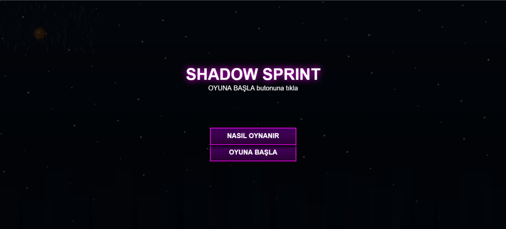
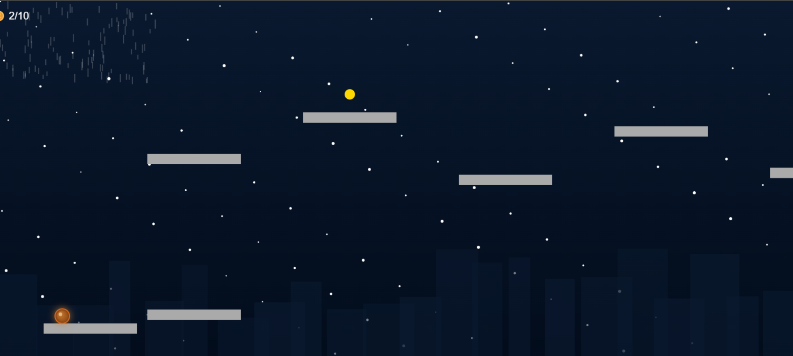

# 🎮 Shadow Sprint

🕹️ **GitHub Pages Linki:**  
🔗 https://ilhandemirel.github.io/ShadowSprint/

🎥 **Oynanış Videosu:**  
📺 [YouTube'da izle](https://youtu.be/C07QVQqW2ZI)

---

## 📌 Nasıl Oynanır?

- **SPACE** veya **Tıklama**: Zıplarsın (2 kez zıplayabilirsin)
- **F** tuşu: Tam ekran moduna geç
- **M** tuşu: Müziği ve sesleri aç/kapat
- Amaç: 10 coin toplayarak kazanmak  
- Düşersen oyunu kaybedersin  
- Troll platformlara dikkat!

---

## 🧠 İlham Alınan Oyun

- **The Rat and The Machine**  
  🔗 https://dirtyonion.itch.io/the-rat-and-the-machine  
  🏆 Ludum Dare Game Jam – %10'luk dilime girmiştir

---

## 🎨 Kullanılan Assetler

### 🎵 Müzik:
- **Arkaplan Müziği (Background.mp3):**  
  [Algorithm Runner - Pixabay](https://pixabay.com/music/pulses-algorithm-runner-dark-cyberpunk-cinematic-music-loopable-185038/?utm_source=chatgpt.com)

### 🔊 Ses Efektleri:
- **Zıplama, Coin, Kazanma Sesleri:**  
  [Victory Sesleri – Pixabay](https://pixabay.com/sound-effects/search/victory/)  
  [Coin Sesleri – Pixabay](https://pixabay.com/sound-effects/search/coin/)

### 🖼️ Görsel:
- **Base Color.png:** Tarafımdan düzenlenmiş basit görsel efekt (platform/zemin yapısı)

> Tüm ses ve müzik dosyaları [Pixabay](https://pixabay.com) üzerinden lisanssız ve ücretsiz içeriklerdir. Eğitim amacıyla kullanılmıştır.

---

## 🧠 Yapay Zeka Kullanımı

Projede oyun mantığının yazımı, zorluk seviyesi planlaması, görsel efektler ve ses kontrolü gibi konularda ChatGPT'den destek alınmıştır. Ayrıntılı promptlar ve cevaplar için [AI.md](AI.md) dosyasını inceleyebilirsiniz.

## 🖼️ Oyun İçi Görseller

### Menü Ekranı

### Oynanış

